# A general workflow for using Git and GitHub

### Overview  
This guide roughly follows along with the in-class demonstration. First, we will walk through GitHub, then cloning a repository using GitHub Desktop and making changes. 

**The main point here is to demonstrate the general clone-push-pull GitHub workflow.** 

## Working on GitHub.com  

### Create a new repository and make changes on GitHub

Step 1
{: .label .label-step}  
From the "Repositories" tab on your dashboard on GitHub.com, click the New button.  
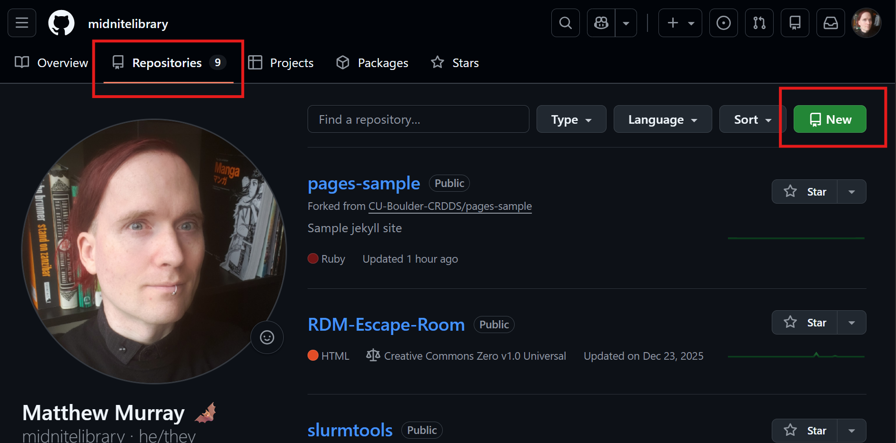

Step 2
{: .label .label-step}  
1. Give the repo a name  
2. Check the Add ReadMe box  
3. Click Create Repository  
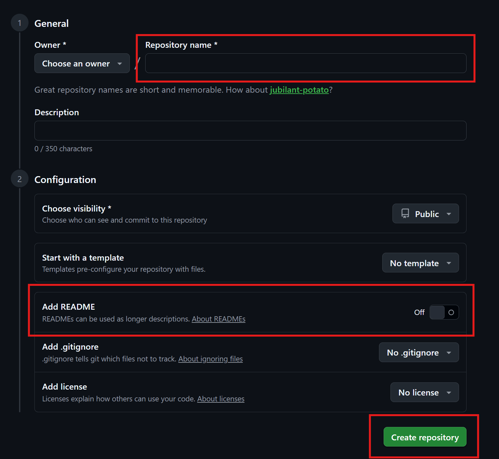

Congrats! You've initialized a repository!  


### Choose a license

You should give your repo a license so that others know how they can use your code.

#### Choose a license when creating your repo

1. Click on "No license." 


2. Choose a license from the options.


#### Give a license to an existing repo

1. Go to an existing repo and click on the "+" and "Create new file."


2. Type "license" for the file name and "Choose a license template" will appear.


3. Select a license and click the "Review and submit" button. (Some licenses work slightly differently.)


#### Hey, the license I want isn't listed

1. GitHub is weird about licenses. There are a lot of other _valid_ licenses that you can (for example) use in advanced search.


2. Go to Git Hub's [Choose a License page](https://choosealicense.com/) and choose one of the options at the bottom of the page.
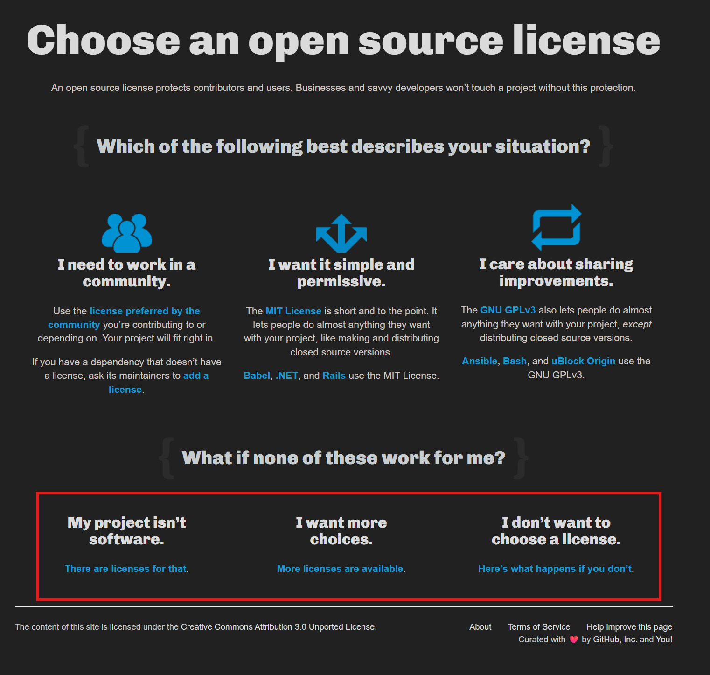

3. Pick a license and then "Copy license text to clipboard" and paste it into your license file or add your repo's URL and hit "enter."


4. Your license should show up in the "About" section of your repo.


#### You can also add license info to your ReadMe

1. Sometimes you might want to have more than one license on your repo and you can indicate this in your README.


### Edit README.md file  

Step 1
{: .label .label-step}  
Click the edit README button.  


Step 2
{: .label .label-step}  
Add a new line to your README, then click Commit.


Step 3
{: .label .label-step}  
Add a commit message, and click Commit to save the changes:
  

Congrats. You've made an edit then committed it.  


### What to include in your README

1. What your project does 

2. How people can use it

3. Who you are and how to contact you

4. License information


### .gitignore files

1. Specifies what items (files, directories, etc.) should never be tracked

2. There are lots of templates that include rules to help Git repositories work with  specific programming languages, frameworks, tools, or environments.


3. [A collection of useful .gitignore templates](https://github.com/github/gitignore).


## GitHub Desktop Client

### Connecting GitHub desktop to your account

Step 1
{: .label .label-step}
In the taskbar select "File" and then "Options" from the drop down menu. Then click on "Sign into GitHub.com."
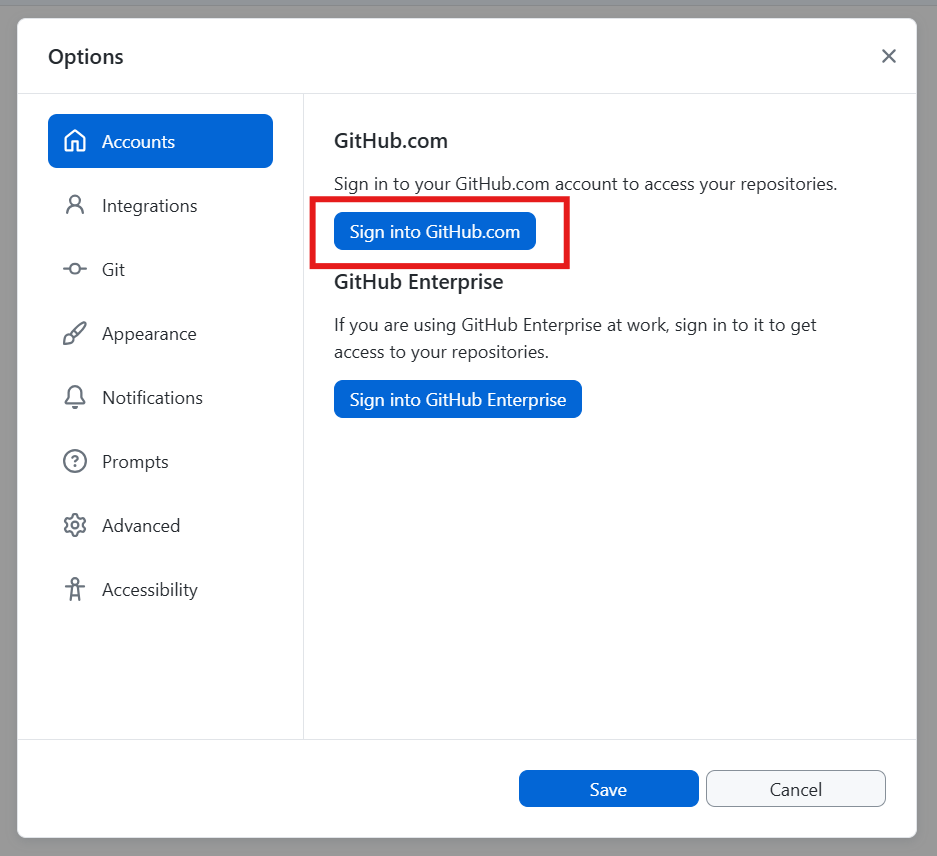  

Step 2
{: .label .label-step}
This will then give a popup to sign in through your browser. Click on "Continue with browser."
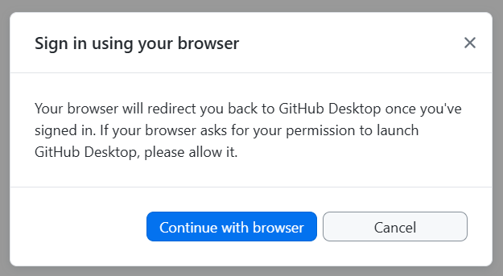  

Step 3
{: .label .label-step}
In your web browser click "Continue" to authorize your account. (Make sure you're logged in!)
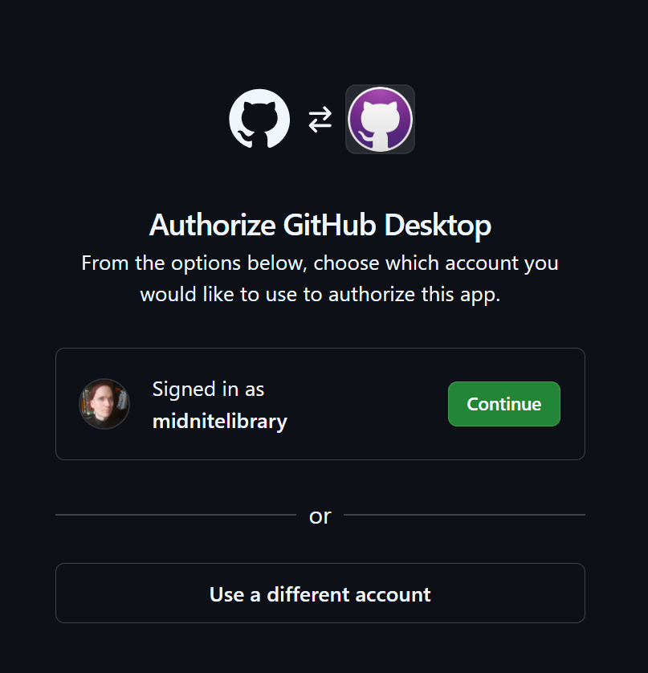  

Step 4
{: .label .label-step}
Click "Open GitHubDesktop.exe" and you will now be signed in and have access to all of your repos.
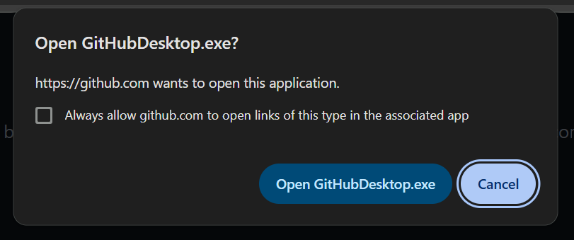  

Note: GitHub sometimes requires use of a two-factor authenication app to log in.

### First, we'll clone our repository to the local machine.  

Step 1
{: .label .label-step}
In GitHub Desktop, click the Clone button:  
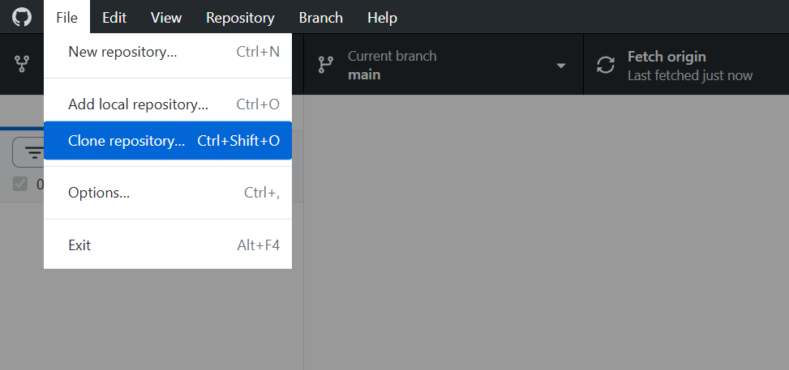  

Step 2
{: .label .label-step}  
Select the example repository just created on GitHub.com, select a destination folder, then click the Clone button. 
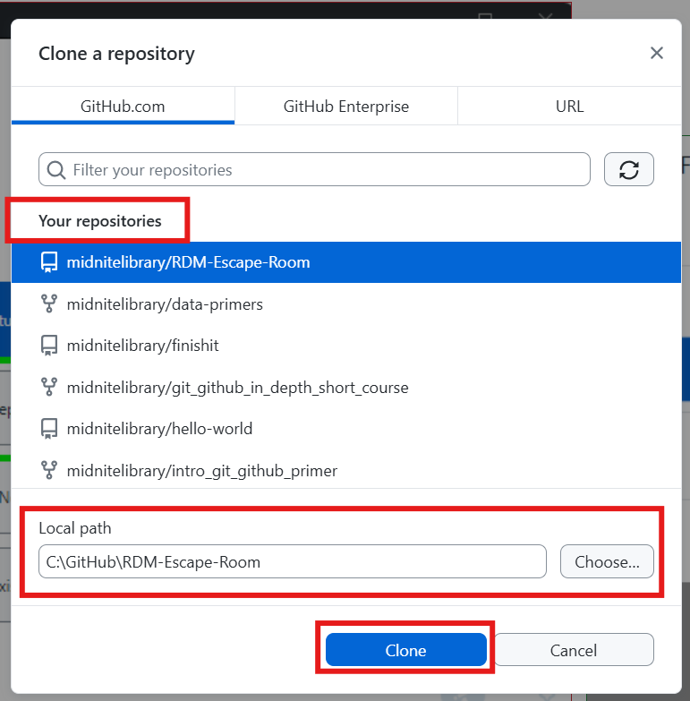  

Step 3
{: .label .label-step}
You can also copy a URL from any public repo and copy it. Click the "Code" button" and then copy the URL and paste it into GitHub.
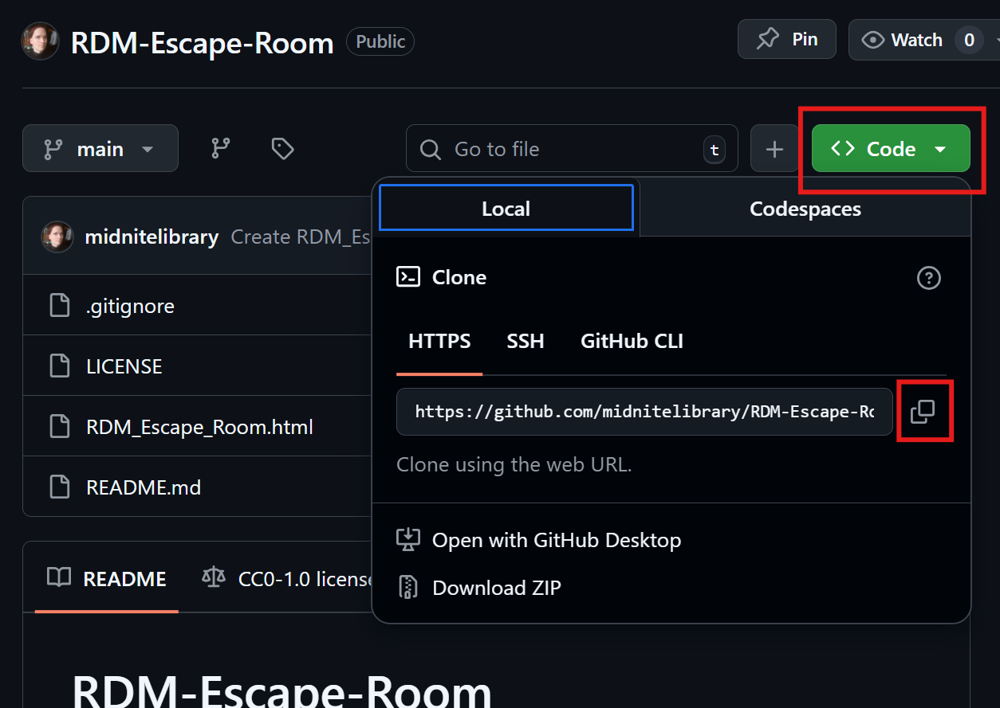  

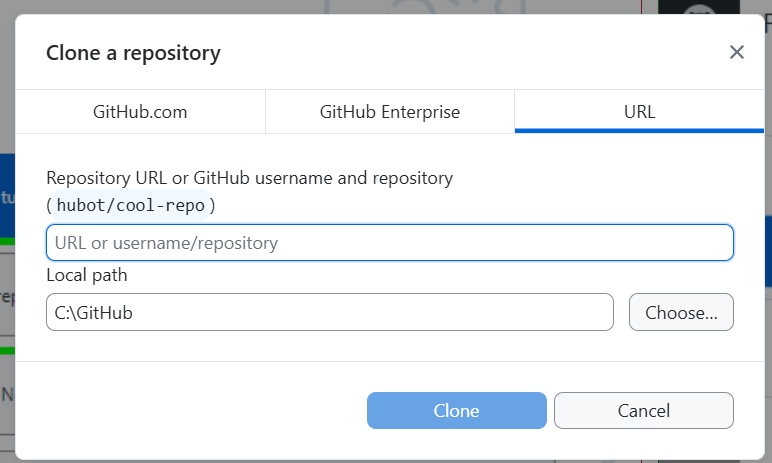  

Now you've downloaded the remote repository to your local machine.  
  

### Committing changes.  

Step 1
{: .label .label-step}
1. Use the File Explorer or Finder app to navigate to the directory holding your repository.  
2. Then create a new file: `newFile.txt`.  
3. Open the file, add a line with some text, and click save.   

Back in GitHub Desktop, note that changes to the files are tracked: 
  

  


Step 2
{: .label .label-step}  
1. Select the files you want to add commit changes to.  
2. Add a commit message  
3. Click commit  
  


### Push changes to the remote repo on GitHub  
Step 1
{: .label .label-step}  
Just click Push Origin!  
  

Now, back on GitHub, the new files have been backed up and tracked.  
  

### Pulling remote changes to the local repo:  

Often, changes are made to the remote, either by you on GitHub.com, or by a collaborator.  

Step 1  
{: .label .label-step}  
As we did before, navigate to the remote repo on GitHub.com and commit a change to one of the files.  

Step 2  
{: .label .label-step}  
Back on GitHub desktop, click Fetch Origin:  
  

Step 3  
{: .label .label-step}  
Now, simply press the Pull Origin button:  
  

Congrats! You've pulled remote changes down to your local repo!  

## Command line workflow:  

All of the above can be accomplished with the command line as long as you have Git installed. This is actually the more common workflow. If you're on Windows, the GitBash terminal/command interface comes with Git. On Mac, you can use the terminal app. Here is a basic example:  


### Cloning the repo:  

Step 1  
{: .label .label-step}
On your repository page on GitHub, click the Code button:  
  
You'll need this URL.  

Step 2  
{: .label .label-step}  
1. Now open your preferred terminal/command line interface, such as GitBash.  
2. Enter the command: ```git clone https://github.com/username/repo_name.git```.  
3. Of course, replace the ```username``` and ```repo_name``` with the actual ones.  
  
Upon completion, the remote repo will now be downloaded to your local machine.  

### Committing and pushing from the command line:  

Step 1  
{: .label .label-step}  
1. Next, modify any file in the repo as we did previously.  
2. Enter the ```git status``` command to see all modified or new files yet to be committed to the repo.  
  
In this example, you can see newFile.txt has been modified, but is not being tracked.  

Step 2  
{: .label .label-step}  
1. Use git add to add newFile.txt: ```git add newFile.txt```  
2. This "stages" the change, but does not yet commit. Think of this as clicking the check box as you do using the desktop app.  
  
3. Now use ```git status``` again to see files ready to commit:  
  
Note the file is now green. It is ready to commit.  
4. Now we will commit. You MUST add a commit message, like this:  
```git commit -m 'added a line to newFile.txt'```   
The ```-m``` is the "message flag"  

Your changes are now committed.  

Step 3
{: .label .label-step}  
Finally, we will push the changes to the remote repository on GitHub using: ```git push origin main```  


Done! Go take a look at your remote repo and you'll see the changes have been pushed.  
